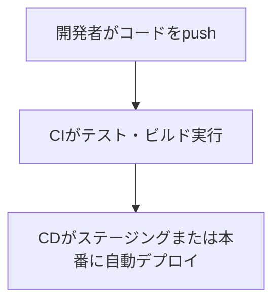

# 🚀 CI/CDとは？（概要とGitHub Actionsの例付き）

## ✅ ざっくり言うと…
> **CI/CDとは、「テスト・ビルド・公開（デプロイ）」の自動化サイクル**のことです。

| 略語 | 意味              | 目的                                 |
|------|-------------------|--------------------------------------|
| CI   | Continuous Integration（継続的インテグレーション） | **テストと統合を自動化**してバグを早期発見 |
| CD   | Continuous Delivery（継続的デリバリー）または Continuous Deployment（継続的デプロイ） | **リリースまで自動化**し、素早くユーザーに届ける |

---

## 🔁 開発の自動化フロー



---

## 🛠️ 用語ごとの役割

### 🧪 CI（継続的インテグレーション）

- コードをプッシュしたときに：
  - ✅ テスト実行（例：単体テスト）
  - ✅ 静的解析（例：lint）
  - ✅ ビルド確認（例：npm run build）

#### ツール例：
- GitHub Actions
- CircleCI
- Travis CI
- Jenkins

---

### 🚚 CD（継続的デリバリー / デプロイ）

| 用語                  | 内容                               |
|-----------------------|------------------------------------|
| **継続的デリバリー**     | 手動でボタンを押せばデプロイできる状態まで自動化 |
| **継続的デプロイ**       | テストが通れば**即本番リリースまで自動化**       |

#### 活用例：
- Webアプリの本番反映
- モバイルアプリのベータ配信
- サーバーレスAPIの更新

---

## 💡 GitHub Actions の CI/CD 例

```yaml
# .github/workflows/deploy.yml
name: Deploy to Production

on:
  push:
    branches: [main]

jobs:
  build-and-deploy:
    runs-on: ubuntu-latest
    steps:
      - uses: actions/checkout@v2
      - name: Run tests
        run: pytest
      - name: Deploy
        run: ./deploy.sh
```

---

## ✅ 導入メリットまとめ

| メリット                         | 説明                                       |
|----------------------------------|--------------------------------------------|
| バグの早期発見                    | push時にテストすることでミスにすぐ気づける       |
| リリースの高速化                  | 手動操作が減り、頻繁な更新が可能になる            |
| チームの開発効率UP                | レビューやマージの前に自動チェックできる         |
| 信頼性の向上                     | 常に同じプロセスで動くので人的ミスが減る         |

---

## ❓ よくある疑問

| 質問                            | 回答                                     |
|---------------------------------|------------------------------------------|
| 必ずCI/CDが必要？               | 小規模でも便利。チーム開発や頻繁な更新には特に有効 |
| お金はかかる？                  | GitHub Actionsは無料枠あり（制限はある）   |
| 難しいスクリプトが必要？         | テンプレートが豊富。最初はコピペでもOK       |

---

> このマニュアルは `.github/workflows/` 配下に設定ファイルを入れることで、CI/CDが動作する仕組みです。