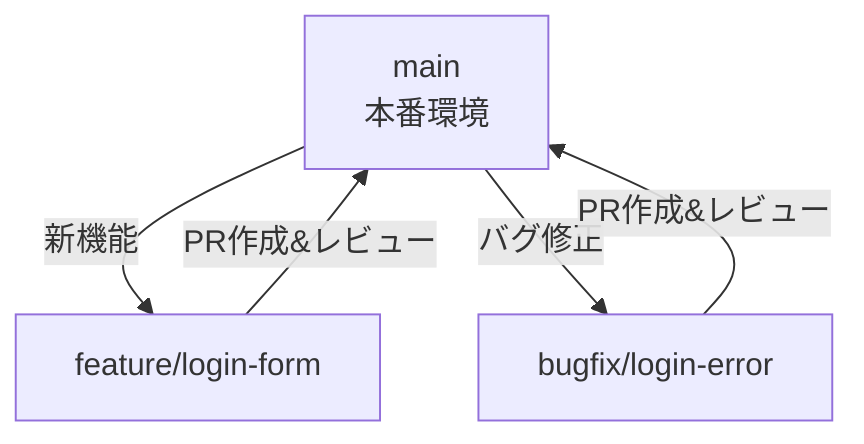

# 🧭 Gitブランチ運用マニュアル（Git Flow & GitHub Flow）

## ✅ ブランチ命名規則

| 用途           | プレフィックス       | 例                              |
|----------------|----------------------|---------------------------------|
| 機能追加       | `feature/`           | `feature/login-form`            |
| バグ修正       | `bugfix/`            | `bugfix/header-overlap`         |
| 緊急修正       | `hotfix/`            | `hotfix/critical-error`         |
| リリース準備   | `release/`           | `release/v1.2.0`                |
| ドキュメント   | `docs/`              | `docs/update-readme`            |
| 試作・実験     | `experiment/`        | `experiment/alt-ui`             |
| 個人作業       | `user/《名前》/`       | `user/《名前》/refactor-theme`  |

---

## 🌿 Git Flow戦略図（ブランチ命名付き）

```mermaid
flowchart TD
  A[main<br>本番環境] -->|マージ<br>(from release/)| A
  R[release/v1.0] --> A
  D[develop<br>統合開発用] --> R
  D --> F1[feature/login-form]
  D --> F2[feature/profile-page]
  F1 --> D
  F2 --> D
  A --> H[hotfix/critical-error]
  H --> A
  H --> D
```

### 💡 Git Flowの使い方：
- `main`：常に本番デプロイ可能な状態を保つ
- `develop`：すべての作業が集まるブランチ
- `feature/`：開発中の新機能ごとの作業
- `release/`：リリース調整とテスト用
- `hotfix/`：本番緊急修正用

---

## ⚡ GitHub Flow戦略図（ブランチ命名付き）



### 💡 GitHub Flowの使い方：
- `main` だけがリリースブランチ
- 作業ブランチは `main` から派生 → PR → レビュー → マージ
- CI/CDで自動テストや本番反映を行う

---

## 🛠 ブランチ保護設定（推奨）

| 設定項目                                     | 内容                                  |
|----------------------------------------------|---------------------------------------|
| Require pull request before merging          | PR経由でのみmainにマージ許可            |
| Require review before merging                | 他のメンバーのレビュー必須              |
| Require status checks to pass                | CIが成功しないとマージ不可              |
| Restrict who can push to matching branches   | 限られたメンバーのみpush可能にする        |

---

## ✨ 運用ヒント

- 1人開発や少人数：GitHub Flowで十分
- 中～大規模・リリース管理重視：Git Flowを導入
- developブランチを軽く導入するハイブリッドもあり

---

## 📎 おまけ：ブランチ命名テンプレート

\`\`\`bash
# 新機能
git checkout -b feature/user-profile

# バグ修正
git checkout -b bugfix/login-failure

# ドキュメント
git checkout -b docs/update-usage
\`\`\`

---

> このマニュアルは `.github/CONTRIBUTING.md` や `docs/branch-guidelines.md` に設置して、チーム内ルールとして活用可能です。